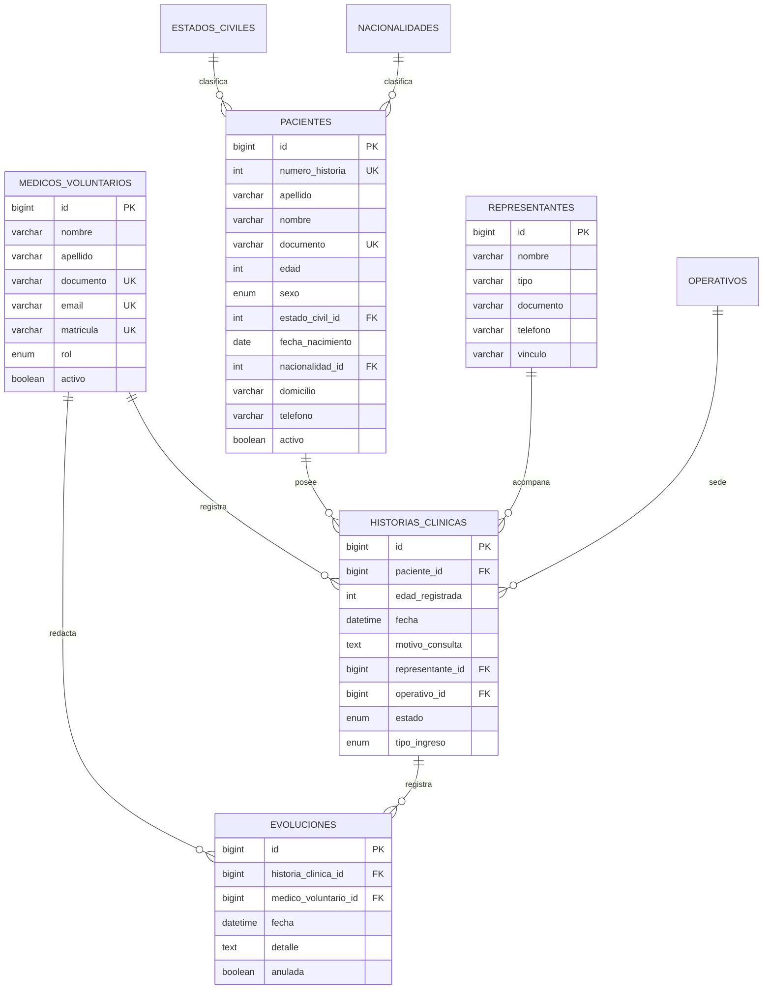

# 03 - Esquema de Base de Datos (MySQL)

> Motor: **MySQL 8.0** · Charset: **utf8mb4** · Collation: **utf8mb4_0900_ai_ci**
> ORM: **Prisma** (definición en `backend/prisma/schema.prisma`)
> Especificación funcional asociada: `01-requerimientos-y-negocio.md`

---

## 1. Convenciones del Modelado

| Aspecto | Convención |
|---|---|
| Nombre de tabla | `snake_case` y **singular** (`paciente`, `historia_clinica`) |
| Nombre de columna | `snake_case` |
| Clave primaria | `id` tipo `BIGINT UNSIGNED` autoincremental |
| Nombres de negocio | `numero_historia`, `motivo_consulta`, `fecha_nacimiento` |
| Booleanos | `TINYINT(1)` (0 = false, 1 = true). En Prisma: `Boolean` |
| Fechas | `DATE` para fechas de calendario · `DATETIME(3)` para marcas de tiempo |
| Textos largos | `TEXT` (`motivo_consulta`, `detalle`, `observaciones`) |
| Montos | `DECIMAL(13,2)` — no aplica en el MVP |
| Auditoría | `created_at` y `updated_at` en **toda** tabla de negocio |
| Borrado | **Lógico** mediante `activo` o `anulada`. Borrado físico prohibido |
| Nombres reservados | Ninguna tabla ni columna usa palabras reservadas de MySQL |

> **Nota sobre el mapeo en Prisma:** los modelos se escriben en `PascalCase` y las columnas en `camelCase`, con `@@map` y `@map` hacia los nombres `snake_case` de MySQL. El nombre físico de la tabla es el que se documenta aquí.

---

## 2. Diagrama Entidad-Relación



### 2.1 Vista de relaciones (ASCII)

```
                      ┌──────────────────────┐
                      │ MEDICOS_VOLUNTARIOS  │
                      │ PK id                │
                      │ rol, matricula       │
                      └──────────┬───────────┘
                                 │ 1
                 ┌───────────────┼────────────────┐
                 │ N                                 │ N
                 ▼                                   ▼
      ┌──────────────────────┐            ┌──────────────────────┐
      │ HISTORIAS_CLINICAS   │ 1          │ EVOLUCIONES          │
      │ PK id                ├───────────►│ PK id                │
      │ FK paciente_id       │     N     │ FK historia_clinica_id│
      │ FK representante_id   │            │ FK medico_voluntario_id
      │ FK operativo_id      │            │ fecha, detalle       │
      │ fecha, motivo        │            └──────────┬───────────┘
      │ estado, tipo_ingreso │                       │
      └──────────┬───────────┘                       │
                 │ N                                 │
                 │                                   │
                 │ 1                                 │
      ┌──────────▼───────────┐                       │
      │ PACIENTES            │◄──────────────────────┘
      │ PK id                │  (via historia_clinica_id)
      │ UK numero_historia   │
      │ apellido, nombre     │
      │ documento, edad      │
      └──────────┬───────────┘
                 │
      ┌──────────┴───────────┬────────────────┐
      │ N                    │ N              │ N
      ▼                      ▼                ▼
┌──────────────┐  ┌──────────────────┐  ┌──────────────┐
│ESTADOS_CIVILES│  │ NACIONALIDADES   │  │  OPERATIVOS  │
└──────────────┘  └──────────────────┘  └──────────────┘

      ┌──────────────────────┐
      │ REPRESENTANTES       │ 1
      │ PK id                ├──────────► N │ HISTORIAS_CLINICAS
      │ nombre, tipo, vinculo│
      └──────────────────────┘
```

---

## 3. Tablas del Núcleo

### 3.1 `pacientes` — Entidad maestra de identidad

Contiene los datos de identificación del paciente (**Bloque B** del formulario). Es la entidad que persiste entre ingresos.

| # | Columna | Tipo | Null | Default | Descripción |
|---|---|---|---|---|---|
| 1 | `id` | `BIGINT UNSIGNED` | NO | AUTO_INCREMENT | PK |
| 2 | `numero_historia` | `INT UNSIGNED` | NO | AUTO_INCREMENT | **Número de Historia** (correlativo, inmutable) |
| 3 | `apellido` | `VARCHAR(80)` | NO | — | Apellido |
| 4 | `nombre` | `VARCHAR(80)` | NO | — | Nombre |
| 5 | `documento` | `VARCHAR(20)` | **SÍ** | `NULL` | Documento. Anulable (RN-01) |
| 6 | `tipo_documento_id` | `BIGINT UNSIGNED` | **SÍ** | `NULL` | FK a `tipos_documento` |
| 7 | `edad` | `TINYINT UNSIGNED` | NO | — | Edad declarada (0–120) |
| 8 | `sexo` | `ENUM('F','M','X','SIN_DATOS')` | NO | `'SIN_DATOS'` | Sexo |
| 9 | `estado_civil_id` | `BIGINT UNSIGNED` | **SÍ** | `NULL` | FK a `estados_civiles` |
| 10 | `fecha_nacimiento` | `DATE` | **SÍ** | `NULL` | Fecha de nacimiento. Anulable (RN-01) |
| 11 | `nacionalidad_id` | `BIGINT UNSIGNED` | **SÍ** | `NULL` | FK a `nacionalidades` |
| 12 | `domicilio` | `VARCHAR(200)` | **SÍ** | `NULL` | Domicilio. Anulable (RN-01) |
| 13 | `telefono` | `VARCHAR(30)` | **SÍ** | `NULL` | Teléfono. Anulable (RN-01) |
| 14 | `sin_domicilio_fijo` | `TINYINT(1)` | NO | `0` | Flag: sin domicilio fijo |
| 15 | `observaciones` | `TEXT` | **SÍ** | `NULL` | Notas internas de identificación |
| 16 | `activo` | `TINYINT(1)` | NO | `1` | Baja lógica (RN-07) |
| 17 | `created_at` | `DATETIME(3)` | NO | `CURRENT_TIMESTAMP(3)` | Auditoría |
| 18 | `updated_at` | `DATETIME(3)` | NO | `CURRENT_TIMESTAMP(3) ON UPDATE` | Auditoría |
| 19 | `created_by` | `BIGINT UNSIGNED` | **SÍ** | `NULL` | FK a `medicos_voluntarios` |

**Claves e índices:**

| Nombre | Tipo | Columnas | Justificación |
|---|---|---|---|
| `PRIMARY` | PRIMARY | `id` | PK |
| `uq_pacientes_numero_historia` | UNIQUE | `numero_historia` | RN-04: identidad de negocio |
| `uq_pacientes_documento` | UNIQUE | `documento` | Evita pacientes duplicados con DNI |
| `ix_pacientes_apellido_nombre` | INDEX | `apellido`, `nombre` | Búsqueda por nombre (RF-03.2) |
| `ix_pacientes_documento_bt` | INDEX | `documento` | Búsqueda por documento |
| `ix_pacientes_activo` | INDEX | `activo` | Filtro de pacientes activos |
| `ix_pacientes_nacionalidad` | INDEX | `nacionalidad_id` | Filtro por nacionalidad |
| `fk_pacientes_estado_civil` | FK | `estado_civil_id` → `estados_civiles(id)` | `ON DELETE RESTRICT` |
| `fk_pacientes_nacionalidad` | FK | `nacionalidad_id` → `nacionalidades(id)` | `ON DELETE SET NULL` |
| `fk_pacientes_tipo_documento` | FK | `tipo_documento_id` → `tipos_documento(id)` | `ON DELETE SET NULL` |
| `fk_pacientes_created_by` | FK | `created_by` → `medicos_voluntarios(id)` | `ON DELETE SET NULL` |

**Restricciones de dominio (CHECK, MySQL 8.0.16+):**

```sql
CONSTRAINT `ck_pacientes_edad` CHECK (`edad` BETWEEN 0 AND 120)
```

> **Nota crítica sobre el índice `uq_pacientes_documento`:** en MySQL los valores `NULL` **no** colisionan en un índice `UNIQUE`, por lo que múltiples pacientes sin documento conviven sin conflicto. La cadena vacía `''` **sí** colisionaría: la capa de aplicación **debe** convertir `''` en `NULL` antes de insertar (ver RN-01).

### 3.2 `historias_clinicas` — Registro de cada ingreso

Un registro por **atención o ingreso** del paciente. Contiene la cabecera (**Bloques A y C**) del formulario.

| # | Columna | Tipo | Null | Default | Descripción |
|---|---|---|---|---|---|
| 1 | `id` | `BIGINT UNSIGNED` | NO | AUTO_INCREMENT | PK |
| 2 | `paciente_id` | `BIGINT UNSIGNED` | NO | — | FK a `pacientes` |
| 3 | `fecha` | `DATETIME` | NO | `CURRENT_TIMESTAMP` | **Fecha** del ingreso (Bloque A) |
| 4 | `edad_registrada` | `TINYINT UNSIGNED` | NO | — | Edad congelada del paciente en este ingreso (RN-02) |
| 5 | `motivo_consulta` | `TEXT` | NO | — | **Motivo de la consulta** (Bloque C) |
| 6 | `representante_id` | `BIGINT UNSIGNED` | **SÍ** | `NULL` | **Representante** (Bloque C, condicional) |
| 7 | `operativo_id` | `BIGINT UNSIGNED` | **SÍ** | `NULL` | FK a `operativos` (puesto/recorrido) |
| 8 | `estado` | `ENUM('ACTIVA','CERRADA','ANULADA')` | NO | `'ACTIVA'` | Estado de la historia |
| 9 | `tipo_ingreso` | `ENUM('CONSULTA','EMERGENCIA','CONTROL','DERIVACION')` | NO | `'CONSULTA'` | Modalidad del ingreso |
| 10 | `resumen` | `TEXT` | **SÍ** | `NULL` | Síntesis del episodio (extensión, fase 6) |
| 11 | `fecha_cierre` | `DATETIME` | **SÍ** | `NULL` | Momento del cierre |
| 12 | `motivo_cierre` | `VARCHAR(200)` | **SÍ** | `NULL` | Causa del cierre |
| 13 | `created_at` | `DATETIME(3)` | NO | `CURRENT_TIMESTAMP(3)` | Auditoría |
| 14 | `updated_at` | `DATETIME(3)` | NO | `CURRENT_TIMESTAMP(3) ON UPDATE` | Auditoría |
| 15 | `medico_voluntario_id` | `BIGINT UNSIGNED` | NO | — | **Médico autor** de la carga (del token) |

**Claves e índices:**

| Nombre | Tipo | Columnas | Justificación |
|---|---|---|---|
| `PRIMARY` | PRIMARY | `id` | PK |
| `ix_hc_paciente` | INDEX | `paciente_id` | Listado de historias del paciente (RF-03.4) |
| `ix_hc_fecha` | INDEX | `fecha` | Orden cronológico y filtros por rango |
| `ix_hc_estado` | INDEX | `estado` | Filtro por estado |
| `ix_hc_paciente_fecha` | INDEX | `paciente_id`, `fecha DESC` | Historial cronológico del paciente |
| `ix_hc_medico` | INDEX | `medico_voluntario_id` | Evoluciones por profesional |
| `ix_hc_operativo` | INDEX | `operativo_id` | Reportes por puesto |
| `fk_hc_paciente` | FK | `paciente_id` → `pacientes(id)` | `ON DELETE RESTRICT` (RN-07) |
| `fk_hc_representante` | FK | `representante_id` → `representantes(id)` | `ON DELETE SET NULL` |
| `fk_hc_operativo` | FK | `operativo_id` → `operativos(id)` | `ON DELETE SET NULL` |
| `fk_hc_medico` | FK | `medico_voluntario_id` → `medicos_voluntarios(id)` | `ON DELETE RESTRICT` |

**Restricciones de dominio:**

```sql
CONSTRAINT `ck_hc_edad`      CHECK (`edad_registrada` BETWEEN 0 AND 120)
CONSTRAINT `ck_hc_cierre`    CHECK ((`estado` = 'CERRADA' AND `fecha_cierre` IS NOT NULL)
                                    OR `estado` <> 'CERRADA')
CONSTRAINT `ck_hc_fecha_no_futura` CHECK (`fecha` <= (NOW() + INTERVAL 1 DAY))
```

> **`ON DELETE RESTRICT` en `historias_clinicas.paciente_id`:** garantiza a nivel de motor que un paciente con historial clínico **no pueda ser eliminado**. La protección real, sin embargo, es la columna `activo` (baja lógica) más la validación de la capa de aplicación; el `RESTRICT` es la red de seguridad.

> **`edad_registrada` (RN-02):** la edad se congela por ingreso. Si el pacientereturning en 2028 con 48 años, la historia de 2026 conserva 45. Sin esta columna, la impresión de una historia histórica mostraría una edad incorrecta, falseando el registro clínico.

### 3.3 `evoluciones` — Registro continuo de la evolución

**Bloque D** del formulario. Anotaciones clínicas cronológicas dentro de un ingreso (RN-05).

| # | Columna | Tipo | Null | Default | Descripción |
|---|---|---|---|---|---|
| 1 | `id` | `BIGINT UNSIGNED` | NO | AUTO_INCREMENT | PK |
| 2 | `historia_clinica_id` | `BIGINT UNSIGNED` | NO | — | FK a `historias_clinicas` |
| 3 | `fecha` | `DATETIME` | NO | `CURRENT_TIMESTAMP` | **Fecha** de la evolución |
| 4 | `detalle` | `TEXT` | NO | — | **Detalle** de la evolución |
| 5 | `medico_voluntario_id` | `BIGINT UNSIGNED` | NO | — | Autor de la anotación (del token) |
| 6 | `anulada` | `TINYINT(1)` | NO | `0` | Anulación lógica (RF-07.2) |
| 7 | `motivo_anulacion` | `VARCHAR(200)` | **SÍ** | `NULL` | Justificación de la anulación |
| 8 | `created_at` | `DATETIME(3)` | NO | `CURRENT_TIMESTAMP(3)` | Auditoría |
| 9 | `updated_at` | `DATETIME(3)` | NO | `CURRENT_TIMESTAMP(3) ON UPDATE` | Auditoría |

**Claves e índices:**

| Nombre | Tipo | Columnas | Justificación |
|---|---|---|---|
| `PRIMARY` | PRIMARY | `id` | PK |
| `ix_ev_hc_fecha` | INDEX | `historia_clinica_id`, `fecha DESC` | Listado cronológico (RF-02.4) |
| `ix_ev_fecha` | INDEX | `fecha` | Reportes por período |
| `ix_ev_medico` | INDEX | `medico_voluntario_id` | Produividad por profesional |
| `fk_ev_hc` | FK | `historia_clinica_id` → `historias_clinicas(id)` | `ON DELETE RESTRICT` (RN-05) |
| `fk_ev_medico` | FK | `medico_voluntario_id` → `medicos_voluntarios(id)` | `ON DELETE RESTRICT` |

**Restricciones de dominio:**

```sql
CONSTRAINT `ck_ev_fecha_no_futura` CHECK (`fecha` <= (NOW() + INTERVAL 1 DAY))
CONSTRAINT `ck_ev_detalle`         CHECK (CHAR_LENGTH(`detalle`) >= 3)
```

> **Inmutabilidad (RF-02.2):** el `detalle` y la `fecha` de una evolución **no se actualizan** una vez insertados. Esto se garantiza en la capa de aplicación (no se expone endpoint de `PATCH` sobre estos campos) y se fiscaliza por auditoría. Una corrección se documenta agregando una nueva evolución.

### 3.4 `medicos_voluntarios` — Usuarios del sistema

| # | Columna | Tipo | Null | Default | Descripción |
|---|---|---|---|---|---|
| 1 | `id` | `BIGINT UNSIGNED` | NO | AUTO_INCREMENT | PK |
| 2 | `nombre` | `VARCHAR(80)` | NO | — | Nombre |
| 3 | `apellido` | `VARCHAR(80)` | NO | — | Apellido |
| 4 | `documento` | `VARCHAR(20)` | NO | — | Documento del profesional |
| 5 | `email` | `VARCHAR(120)` | NO | — | Email (login) |
| 6 | `password_hash` | `VARCHAR(255)` | NO | — | Hash bcrypt/argon2. **Nunca texto plano** |
| 7 | `matricula` | `VARCHAR(40)` | **SÍ** | `NULL` | Matrícula profesional |
| 8 | `especialidad` | `VARCHAR(80)` | **SÍ** | `NULL` | Especialidad |
| 9 | `telefono` | `VARCHAR(30)` | **SÍ** | `NULL` | Teléfono de contacto |
| 10 | `rol` | `ENUM('MEDICO','COORDINADOR','ADMIN')` | NO | `'MEDICO'` | Rol y permisos |
| 11 | `activo` | `TINYINT(1)` | NO | `1` | Baja lógica (RF-04.4) |
| 12 | `ultimo_acceso` | `DATETIME` | **SÍ** | `NULL` | Último login |
| 13 | `created_at` | `DATETIME(3)` | NO | `CURRENT_TIMESTAMP(3)` | Auditoría |
| 14 | `updated_at` | `DATETIME(3)` | NO | `CURRENT_TIMESTAMP(3) ON UPDATE` | Auditoría |

**Claves e índices:**

| Nombre | Tipo | Columnas | Justificación |
|---|---|---|---|
| `PRIMARY` | PRIMARY | `id` | PK |
| `uq_mv_email` | UNIQUE | `email` | Login único |
| `uq_mv_documento` | UNIQUE | `documento` | Identidad del profesional |
| `uq_mv_matricula` | UNIQUE | `matricula` | Unicidad de matrícula |
| `ix_mv_activo` | INDEX | `activo` | Listado de profesionales activos |
| `ix_mv_apellido` | INDEX | `apellido` | Búsqueda y ordenamiento |

> **`password_hash` con `VARCHAR(255)`:** dimensionado para alojar el hash de argon2id (formato con guiones y base64) y bcrypt (60 caracteres). Un `VARCHAR(60)` quedaría corto y obligaría a truncar el hash, invalidándolo silenciosamente.

> **La tabla `medicos_voluntarios` cumple doble función:** es a la vez la entidad de datos profesionales y la tabla de **usuarios** del sistema. La autenticación (RF-04) opera sobre esta tabla.

---

## 4. Tablas de Soporte

### 4.1 `representantes` — Nexo de contacto del paciente

Sustenta el campo **Representante** del formulario (RN-03). Permite registrar personas físicas y organizaciones.

| # | Columna | Tipo | Null | Default | Descripción |
|---|---|---|---|---|---|
| 1 | `id` | `BIGINT UNSIGNED` | NO | AUTO_INCREMENT | PK |
| 2 | `nombre` | `VARCHAR(120)` | NO | — | Nombre o razón social |
| 3 | `tipo` | `ENUM('PERSONA','ORGANIZACION','EFECTOR')` | NO | `'PERSONA'` | Tipo de representante |
| 4 | `documento` | `VARCHAR(20)` | **SÍ** | `NULL` | Documento |
| 5 | `telefono` | `VARCHAR(30)` | **SÍ** | `NULL` | Teléfono |
| 6 | `email` | `VARCHAR(120)` | **SÍ** | `NULL` | Email |
| 7 | `vinculo` | `VARCHAR(80)` | **SÍ** | `NULL` | Parentesco o relación |
| 8 | `direccion` | `VARCHAR(200)` | **SÍ** | `NULL` | Dirección |
| 9 | `created_at` | `DATETIME(3)` | NO | `CURRENT_TIMESTAMP(3)` | Auditoría |
| 10 | `updated_at` | `DATETIME(3)` | NO | `CURRENT_TIMESTAMP(3) ON UPDATE` | Auditoría |

**Índices:** `ix_representantes_nombre` sobre `nombre`; `ix_representantes_documento` sobre `documento`.

> **Normalización:** el representante **no** es el paciente ni el médico. Se modela aparte porque un mismo representante (un efector de salud, una organización social) acompaña a **muchos** pacientes; duplicar sus datos en cada historia generaría inconsistencia.

### 4.2 `estados_civiles` — Catálogo

| Columna | Tipo | Null | Default | Descripción |
|---|---|---|---|---|
| `id` | `BIGINT UNSIGNED` | NO | AUTO_INCREMENT | PK |
| `nombre` | `VARCHAR(40)` | NO | — | Denominación |
| `orden` | `TINYINT UNSIGNED` | NO | `0` | Orden de presentación |
| `activo` | `TINYINT(1)` | NO | `1` | Baja lógica del ítem |

**Restricción:** `UNIQUE (nombre)`.

**Carga inicial (seed):** Soltero/a, Casado/a, Unión libre, Separado/a, Divorciado/a, Viudo/a, Sin datos.

### 4.3 `nacionalidades` — Catálogo

| Columna | Tipo | Null | Default | Descripción |
|---|---|---|---|---|
| `id` | `BIGINT UNSIGNED` | NO | AUTO_INCREMENT | PK |
| `nombre` | `VARCHAR(60)` | NO | — | Denominación |
| `codigo_iso` | `CHAR(3)` | **SÍ** | `NULL` | Código ISO 3166-1 alfa-3 |
| `orden` | `TINYINT UNSIGNED` | NO | `0` | Orden de presentación |
| `activo` | `TINYINT(1)` | NO | `1` | Baja lógica del ítem |

**Restricciones:** `UNIQUE (nombre)`, `UNIQUE (codigo_iso)`.

**Carga inicial:** lista completa de países, con `Argentina` como primer ítem por ser el contexto por defecto.

### 4.4 `tipos_documento` — Catálogo

| Columna | Tipo | Null | Default | Descripción |
|---|---|---|---|---|
| `id` | `BIGINT UNSIGNED` | NO | AUTO_INCREMENT | PK |
| `nombre` | `VARCHAR(60)` | NO | — | Denominación |
| `sigla` | `VARCHAR(10)` | **SÍ** | `NULL` | Sigla (DNI, CED, PAS, SIN_DOC) |
| `requiere_numero` | `TINYINT(1)` | NO | `1` | Si exige número |
| `orden` | `TINYINT UNSIGNED` | NO | `0` | Orden de presentación |
| `activo` | `TINYINT(1)` | NO | `1` | Baja lógica del ítem |

**Restricción:** `UNIQUE (nombre)`.

**Carga inicial:** DNI, Cédula, Pasaporte, Documento de emergencia, **Sin documento**.

> Esta tabla responde a la pregunta abierta N° 2 de `01-requerimientos-y-negocio.md`: la población atendida mayoritariamente **no tiene DNI**, y el sistema debe poder expresar "no tiene documento" como un dato explícito y no como un campo vacío.

### 4.5 `operativos` — Puestos de atención (extensión)

| Columna | Tipo | Null | Default | Descripción |
|---|---|---|---|---|
| `id` | `BIGINT UNSIGNED` | NO | AUTO_INCREMENT | PK |
| `nombre` | `VARCHAR(80)` | NO | — | Nombre del puesto o recorrido |
| `direccion` | `VARCHAR(200)` | **SÍ** | `NULL` | Ubicación |
| `activo` | `TINYINT(1)` | NO | `1` | Baja lógica |

**Restricción:** `UNIQUE (nombre)`.

> Tabla de extensión. Permite responder preguntas como *"¿cuántos pacientes atendimos en el puesto del centro?"*. Se implementa en la Fase 6 junto con el dashboard.

### 4.6 `auditoria` — Rastro de operaciones (extensión)

| Columna | Tipo | Null | Default | Descripción |
|---|---|---|---|---|
| `id` | `BIGINT UNSIGNED` | NO | AUTO_INCREMENT | PK |
| `usuario_id` | `BIGINT UNSIGNED` | **SÍ** | `NULL` | Médico que operó |
| `entidad` | `VARCHAR(40)` | NO | — | Tabla afectada |
| `registro_id` | `BIGINT UNSIGNED` | **SÍ** | `NULL` | PK del registro afectado |
| `accion` | `ENUM('CREATE','UPDATE','DELETE','ANULAR','REABRIR','LECTURA')` | NO | — | Tipo de operación |
| `campo_anterior` | `JSON` | **SÍ** | `NULL` | Valor previo |
| `campo_nuevo` | `JSON` | **SÍ** | `NULL` | Valor nuevo |
| `ip` | `VARCHAR(45)` | **SÍ** | `NULL` | Dirección IP (soporta IPv6) |
| `user_agent` | `VARCHAR(255)` | **SÍ** | `NULL` | Navegador/dispositivo |
| `created_at` | `DATETIME(3)` | NO | `CURRENT_TIMESTAMP(3)` | Momento exacto |

**Índices:** `ix_auditoria_entidad` (`entidad`, `registro_id`), `ix_auditoria_fecha` (`created_at`), `ix_auditoria_usuario` (`usuario_id`).

> Tabla **append-only**: solo admite `INSERT`. Cubre RNF-12 y RNF-13. Dado el volumen esperado (un registro por paciente por visita), se implementa en la Fase 5 y puede archivarse mensualmente a una tabla histórica si el volumen lo exige.

---

## 5. Mapeo de Requerimientos a Tablas

| Campo del formulario | Bloque | Tabla | Columna | Tipo |
|---|---|---|---|---|
| Número de Historia | A | `pacientes` | `numero_historia` | `INT UNSIGNED` |
| Fecha | A | `historias_clinicas` | `fecha` | `DATETIME` |
| Apellido | B | `pacientes` | `apellido` | `VARCHAR(80)` |
| Nombre | B | `pacientes` | `nombre` | `VARCHAR(80)` |
| Documento | B | `pacientes` | `documento` (+ `tipo_documento_id`) | `VARCHAR(20)` |
| Edad | B | `pacientes` | `edad` | `TINYINT UNSIGNED` |
| Sexo | B | `pacientes` | `sexo` | `ENUM` |
| Estado civil | B | `pacientes` | `estado_civil_id` | `BIGINT UNSIGNED` FK |
| Fecha de nacimiento | B | `pacientes` | `fecha_nacimiento` | `DATE` |
| Nacionalidad | B | `pacientes` | `nacionalidad_id` | `BIGINT UNSIGNED` FK |
| Domicilio | B | `pacientes` | `domicilio` | `VARCHAR(200)` |
| Teléfono | B | `pacientes` | `telefono` | `VARCHAR(30)` |
| Representante | C | `historias_clinicas` | `representante_id` | `BIGINT UNSIGNED` FK |
| Motivo de la consulta | C | `historias_clinicas` | `motivo_consulta` | `TEXT` |
| **Evolución — Fecha** | **D** | `evoluciones` | `fecha` | `DATETIME` |
| **Evolución — Detalle** | **D** | `evoluciones` | `detalle` | `TEXT` |
| *(autoría, no visible en el formulario)* | — | las 3 tablas | `medico_voluntario_id` | `BIGINT UNSIGNED` FK |

---

## 6. Definición en Prisma (extracto ilustrativo)

> Extracto **ilustrativo** de `backend/prisma/schema.prisma`. Sirve para fijar la convención de mapeo; la definición completa se redacta en la Fase 2.

```prisma
generator client {
  provider = "prisma-client-js"
}

datasource db {
  provider = "mysql"
  url      = env("DATABASE_URL")
}

model Paciente {
  id              BigInt    @id @default(autoincrement())
  numeroHistoria  Int       @unique @default(autoincrement()) @map("numero_historia")
  apellido        String    @db.VarChar(80)
  nombre          String    @db.VarChar(80)
  documento       String?   @unique @db.VarChar(20)
  tipoDocumentoId BigInt?   @map("tipo_documento_id")
  edad            Int       @db.TinyInt
  sexo            Sexo      @default(SIN_DATOS)
  estadoCivilId   BigInt?   @map("estado_civil_id")
  fechaNacimiento DateTime? @map("fecha_nacimiento") @db.Date
  nacionalidadId  BigInt?   @map("nacionalidad_id")
  domicilio       String?   @db.VarChar(200)
  telefono        String?   @db.VarChar(30)
  sinDomicilioFijo Boolean  @default(false) @map("sin_domicilio_fijo")
  observaciones   String?   @db.Text
  activo          Boolean   @default(true)
  createdAt       DateTime  @default(now()) @map("created_at") @db.DateTime(3)
  updatedAt       DateTime  @updatedAt @map("updated_at") @db.DateTime(3)
  createdBy       BigInt?   @map("created_by")

  estadoCivil   EstadoCivil?  @relation(fields: [estadoCivilId], references: [id], onDelete: Restrict)
  nacionalidad  Nacionalidad? @relation(fields: [nacionalidadId], references: [id], onDelete: SetNull)
  tipoDocumento TipoDocumento? @relation(fields: [tipoDocumentoId], references: [id], onDelete: SetNull)
  historias     HistoriaClinica[]
  creadoPor     MedicoVoluntario? @relation(fields: [createdBy], references: [id], onDelete: SetNull)

  @@index([apellido, nombre], map: "ix_pacientes_apellido_nombre")
  @@index([activo], map: "ix_pacientes_activo")
  @@index([nacionalidadId], map: "ix_pacientes_nacionalidad")
  @@map("pacientes")
}

model HistoriaClinica {
  id                BigInt        @id @default(autoincrement())
  pacienteId        BigInt        @map("paciente_id")
  fecha             DateTime      @default(now())
  edadRegistrada    Int           @map("edad_registrada") @db.TinyInt
  motivoConsulta    String        @map("motivo_consulta") @db.Text
  representanteId    BigInt?       @map("representante_id")
  operativoId       BigInt?       @map("operativo_id")
  estado            EstadoHistoria @default(ACTIVA)
  tipoIngreso       TipoIngreso   @default(CONSULTA) @map("tipo_ingreso")
  resumen           String?       @db.Text
  fechaCierre       DateTime?     @map("fecha_cierre")
  motivoCierre      String?       @map("motivo_cierre") @db.VarChar(200)
  createdAt         DateTime      @default(now()) @map("created_at") @db.DateTime(3)
  updatedAt         DateTime      @updatedAt @map("updated_at") @db.DateTime(3)
  medicoVoluntarioId BigInt       @map("medico_voluntario_id")

  paciente     Paciente         @relation(fields: [pacienteId], references: [id], onDelete: Restrict)
  representante Representante?   @relation(fields: [representanteId], references: [id], onDelete: SetNull)
  operativo    Operativo?      @relation(fields: [operativoId], references: [id], onDelete: SetNull)
  medico       MedicoVoluntario @relation(fields: [medicoVoluntarioId], references: [id], onDelete: Restrict)
  evoluciones  Evolucion[]

  @@index([pacienteId, fecha(sort: Desc)], map: "ix_hc_paciente_fecha")
  @@index([fecha], map: "ix_hc_fecha")
  @@index([estado], map: "ix_hc_estado")
  @@index([medicoVoluntarioId], map: "ix_hc_medico")
  @@map("historias_clinicas")
}

model Evolucion {
  id                BigInt   @id @default(autoincrement())
  historiaClinicaId BigInt   @map("historia_clinica_id")
  fecha             DateTime @default(now())
  detalle           String   @db.Text
  medicoVoluntarioId BigInt  @map("medico_voluntario_id")
  anulada           Boolean  @default(false)
  motivoAnulacion   String?  @map("motivo_anulacion") @db.VarChar(200)
  createdAt         DateTime @default(now()) @map("created_at") @db.DateTime(3)
  updatedAt         DateTime @updatedAt @map("updated_at") @db.DateTime(3)

  historiaClinica HistoriaClinica @relation(fields: [historiaClinicaId], references: [id], onDelete: Restrict)
  medico          MedicoVoluntario @relation(fields: [medicoVoluntarioId], references: [id], onDelete: Restrict)

  @@index([historiaClinicaId, fecha(sort: Desc)], map: "ix_ev_hc_fecha")
  @@index([fecha], map: "ix_ev_fecha")
  @@index([medicoVoluntarioId], map: "ix_ev_medico")
  @@map("evoluciones")
}

enum Sexo {
  F
  M
  X
  SIN_DATOS
}

enum EstadoHistoria {
  ACTIVA
  CERRADA
  ANULADA
}

enum TipoIngreso {
  CONSULTA
  EMERGENCIA
  CONTROL
  DERIVACION
}
```

---

## 7. Estrategia de Índices

### 7.1 Índices compuestos

| Índice | Columnas | Consulta que optimiza |
|---|---|---|
| `ix_hc_paciente_fecha` | `paciente_id`, `fecha DESC` | Historial cronológico de un paciente (RF-03.4) |
| `ix_ev_hc_fecha` | `historia_clinica_id`, `fecha DESC` | Evoluciones de una historia, ordenadas (RF-02) |
| `ix_pacientes_apellido_nombre` | `apellido`, `nombre` | Búsqueda por apellido y nombre (RF-03.2) |

> Los índices compuestos siguen el **orden de la consulta**: primero la columna de igualdad (`paciente_id`), luego la de ordenamiento (`fecha`). Invertir el orden produce un índice inservible para esa consulta.

### 7.2 Estrategia para la búsqueda de texto libre (RF-03.2 / RF-03.6)

El campo `q` busca simultáneamente en `numero_historia`, `documento`, `apellido` y `nombre`. En el MVP se resuelve con:

```sql
WHERE (apellido LIKE CONCAT('%', ?, '%') OR nombre LIKE ?)
   OR documento LIKE ?
   OR numero_historia = ?
```

**Apoyos:**
1. Collation `utf8mb4_0900_ai_ci`: `LIKE` y `=` son insensibles a mayúsculas y acentos **de forma nativa**.
2. `apellido` y `nombre` agrupados en un índice compuesto, que cubre el `LIKE '%…%'` cuando el patrón comienza con valor fijo.
3. El `OR numero_historia = ?` es un acceso directo por índice.

**Si el volumen lo justifica (fuera del MVP):** migrar a índice `FULLTEXT` (`ngram` para español, que requiere `ngram_token_size=2`) sobre un campo desnormalizado `texto_busqueda`. Se deja documentado como mejora de rendimiento, vinculada a RNF-05.

### 7.3 Paginación

Todas las listas usan `skip` / `take` de Prisma (portable, genera `LIMIT/OFFSET` internamente) con el `ORDER BY` siempre presente y **estable** (ordenar por `id` como último criterio evita páginas inconsistentes cuando dos filas empatan en la fecha).

---

## 8. Integridad Referencial

### 8.1 Reglas `ON DELETE`

| Relación | `ON DELETE` | Justificación |
|---|---|---|
| `historias_clinicas.paciente_id` | `RESTRICT` | No se permite borrar un paciente con historial (RN-07) |
| `historias_clinicas.medico_voluntario_id` | `RESTRICT` | La autoría es inmutable (RF-07) |
| `historias_clinicas.representante_id` | `SET NULL` | El representante es accesorio; perderlo no invalida la historia |
| `historias_clinicas.operativo_id` | `SET NULL` | Ídem |
| `evoluciones.historia_clinica_id` | `RESTRICT` | No hay evoluciones huérfanas (RN-05) |
| `evoluciones.medico_voluntario_id` | `RESTRICT` | La autoría es inmutable (RF-07) |
| `pacientes.estado_civil_id` | `RESTRICT` | Catálogo maestro: se desactiva, no se borra |
| `pacientes.nacionalidad_id` | `SET NULL` | Ídem |
| `pacientes.tipo_documento_id` | `SET NULL` | Ídem |
| `pacientes.created_by` | `SET NULL` | Permite desactivar médicos sin perder trazabilidad |

### 8.2 Errores de Prisma y su traducción HTTP

| Código Prisma | Significado | Excepción NestJS | Mensaje al usuario |
|---|---|---|---|
| `P2002` | Violación de `UNIQUE` | `ConflictException` (409) | *"Ya existe un registro con ese valor"* |
| `P2003` | Violación de `FOREIGN KEY` | `ConflictException` (409) | *"No se puede eliminar: el registro tiene datos asociados"* |
| `P2025` | Registro no encontrado | `NotFoundException` (404) | *"El registro solicitado no existe"* |
| `P2014` | Violación de relación requerida | `BadRequestException` (400) | *"Falta un dato obligatorio relacionado"* |

---

## 9. Transacciones

### 9.1 Alta de paciente con primer ingreso (RN-02 / CU-01)

La creación de un paciente implica **tres** inserciones. Deben ser atómicas:

```
BEGIN
  1. INSERT INTO pacientes (...) VALUES (...)            → obtiene numero_historia
  2. INSERT INTO historias_clinicas (...) VALUES (...)   → obtiene id
  3. INSERT INTO evoluciones (...) VALUES (...)          → evolución inicial obligatoria
COMMIT
```

Si la etapa 3 falla, se revierte el alta completa. **Nunca debe existir una historia clínica sin evolución inicial ni un paciente sin historia.**

**Implementación (Prisma):**

```typescript
await this.prisma.$transaction(async (tx) => {
  const paciente   = await tx.paciente.create({ data: datosPaciente });
  const historia   = await tx.historiaClinica.create({ data: { pacienteId: paciente.id, ...datosIngreso } });
  await tx.evolucion.create({ data: { historiaClinicaId: historia.id, ...evolucionInicial, medicoVoluntarioId: usuarioId } });
  return { paciente, historia };
});
```

### 9.2 Cierre de historia clínica con nota de cierre (Fase 6)

```
BEGIN
  1. UPDATE historias_clinicas SET estado='CERRADA', fecha_cierre=?, motivo_cierre=?
  2. INSERT INTO evoluciones (...)   → nota de cierre
COMMIT
```

### 9.3 Consideración del nivel de aislamiento

Se utiliza el nivel por defecto de MySQL (`REPEATABLE READ`) con InnoDB. Para operaciones de lectura del dashboard se considera `READ COMMITTED` a fin de reducir el bloqueo de filas durante la agregación de información clínica concurrente.

---

## 10. Estrategia de Datos Iniciales (Seed)

`prisma/seed.ts` inserta, de forma **idempotente** (verificable con `upsert`):

| Catálogo | Contenido |
|---|---|
| `estados_civiles` | 7 estados (incluida "Sin datos") |
| `nacionalidades` | Lista de países con `Argentina` primero |
| `tipos_documento` | DNI, Cédula, Pasaporte, Documento de emergencia, Sin documento |
| `operativos` | Los puestos de atención definidos por la organización |
| `medicos_voluntarios` | **Un** usuario `ADMIN` inicial, con contraseña **leída de `.env`** y hash generado en tiempo de ejecución |

**Reglas del seed:**

- **Prohibido** contener contraseñas hardcodeadas en el repositorio. La contraseña del administrador inicial se lee de una variable de entorno.
- El seed **no inserta datos de pacientes ni de historias clínicas ficticias** en la base compartida. Si se necesitan datos de prueba, se usan bases separadas y scripts explícitos, nunca el seed de producción.
- Es idempotente: puede ejecutarse varias veces sin duplicar registros.

---

## 11. Seguridad de la Base de Datos

| Medida | Aplicación |
|---|---|
| Usuario de aplicación | Usuario dedicado con permisos **solo** sobre el esquema propio |
| Privilegios | `SELECT, INSERT, UPDATE, DELETE`. **Sin** `DROP`, `ALTER`, `CREATE` en runtime |
| Conexión | Charset `utf8mb4` forzado en la URL de conexión |
| Contraseña | Fuera del repositorio, en variable de entorno |
| Conexión en tránsito | TLS si la base no reside en el mismo host |
| Puerto | MySQL **no** expuesto a Internet; solo accesible desde el backend |
| Credenciales | El frontend **nunca** accede a la base de datos |

---

## 12. Copias de Seguridad

| Aspecto | Definición |
|---|---|
| Frecuencia | Dump completo diario + binarios incrementales semanales |
| Retención | Mínimo 30 días diarios; 12 meses mensuales |
| Cifrado | Sí, en reposo |
| Ubicación | Almacenamiento externo al servidor de aplicación |
| **Verificación** | **Procedimiento de restauración probado trimestralmente** (RNF-18) |
| Documentación | Procedimiento de restauración escrito y accesible al responsable de datos |

> Una copia de seguridad no verificada no es una copia de seguridad: es una hipótesis.

---

## 13. Resumen de Objetos

| Tabla | Tipo | Propósito |
|---|---|---|
| `pacientes` | Núcleo | Identidad del paciente (Bloque B) |
| `historias_clinicas` | Núcleo | Cada ingreso (Bloques A y C) |
| `evoluciones` | Núcleo | Registro continuo (Bloque D) |
| `medicos_voluntarios` | Núcleo | Usuarios y autores de los registros |
| `representantes` | Soporte | Nexo de contacto del paciente |
| `estados_civiles` | Soporte | Catálogo |
| `nacionalidades` | Soporte | Catálogo |
| `tipos_documento` | Soporte | Catálogo |
| `operativos` | Soporte | Puestos de atención |
| `auditoria` | Soporte | Rastro de operaciones |

**Total: 4 tablas núcleo + 6 de soporte.**

---

## 14. Reglas para Modificar el Esquema

1. Toda alteração de esquema se realiza mediante **migración Prisma versionada y nombrada**: `npx prisma migrate dev --name <descripcion>`.
2. **Prohibido** `prisma migrate reset` en staging y producción. **Prohibido** ejecutar DDL desde el código de aplicación.
3. Toda columna nueva se define con valor por defecto o anulable, para no romper la tabla en producción.
4. Toda columna eliminada se marca como obsoleta en una primera migración y se elimina en una segunda, posterior a la verificación del despliegue.
5. Los cambios destructivos (borrado masivo, alteración de tipo incompatible) requieren migración manual revisada por dos personas y copia de seguridad verificada previa.
6. El esquema en `schema.prisma` es la **fuente de verdad**: si hay discrepancia entre el código y el esquema, el esquema manda.
